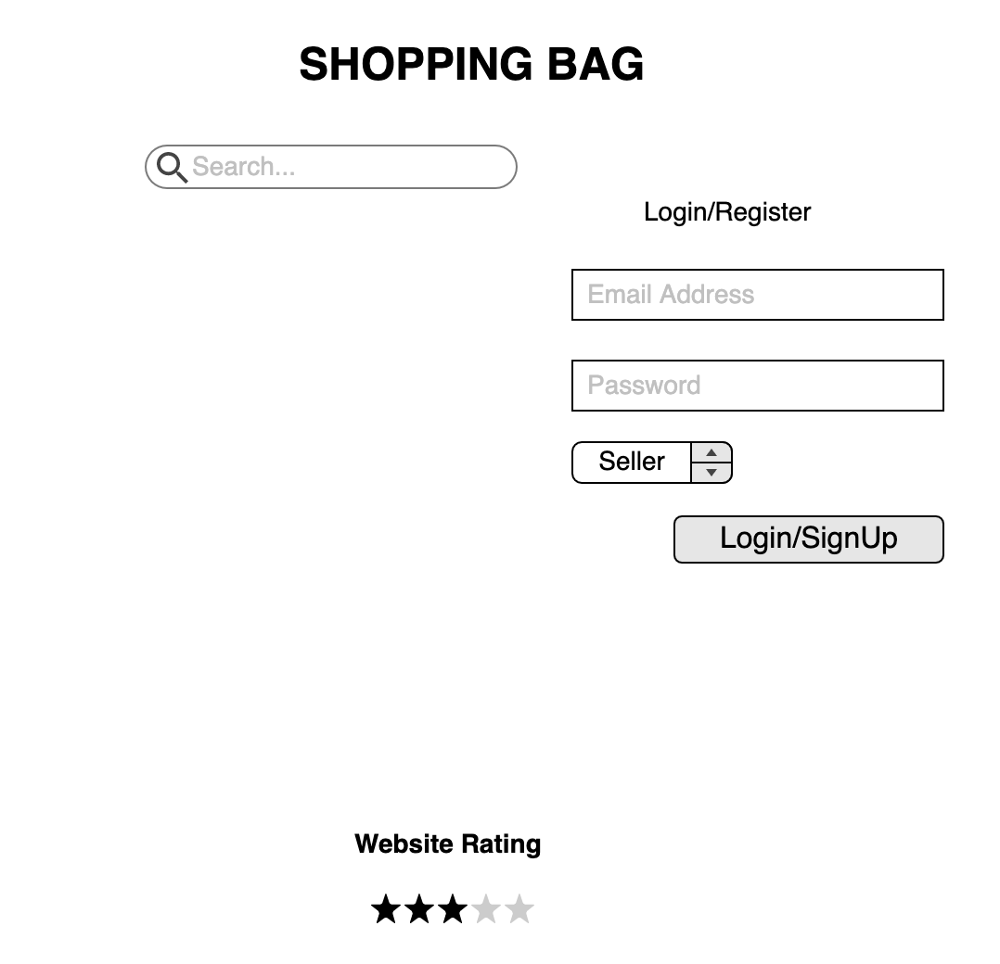
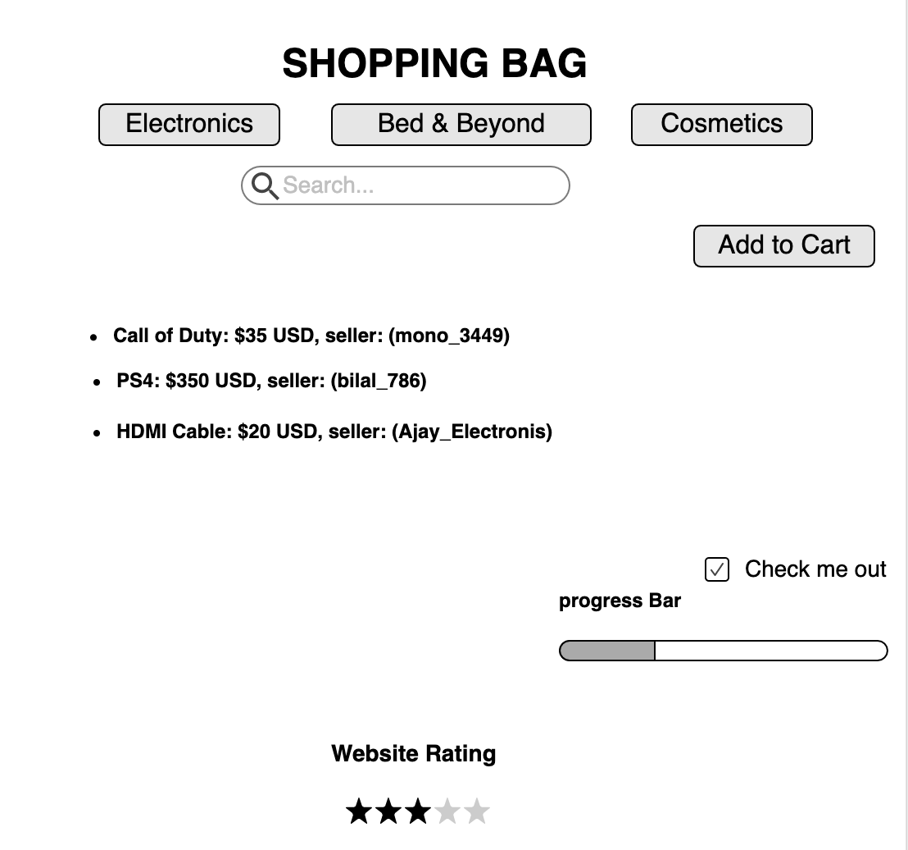
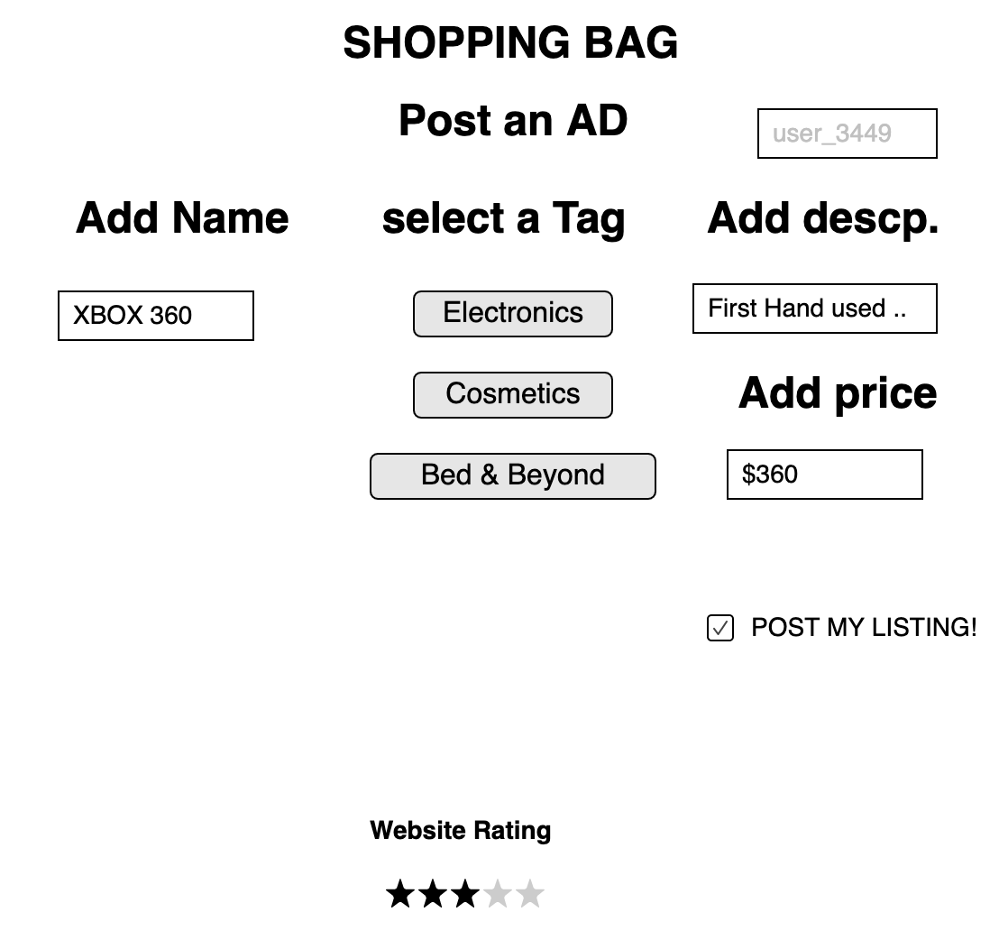
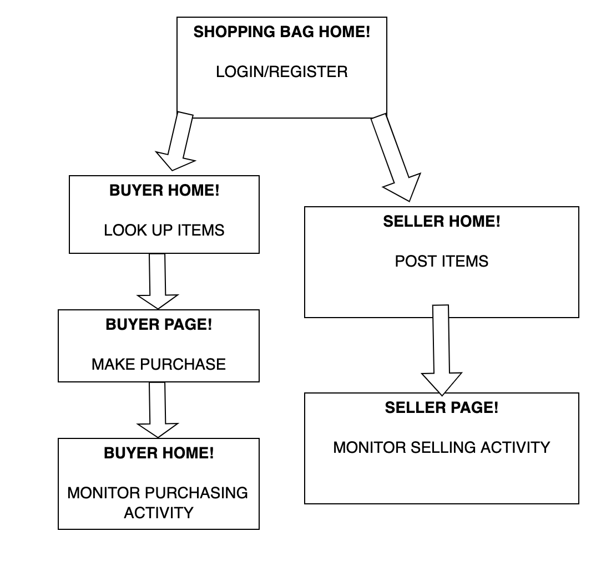

The content below is an documentation of my project proposal / requirements document. 

(Project Name: Shopping_Bag)

# Shopping Bag 

## Overview

(A high-level description of my project_)

Having a central E-commerce site that allows you to make purchases and sell items is a digital paradise for all shopaholics. This allows users to keep track of their past purchases and monitor their purchasing and selling activitites through a central site.

Shopping Bag is a web application that allows users to purchase and sell items on the same website. Users can simply log in as buyers or sellers and purchase or sell items. 


## Data Model

(A description of my application's data and their relationships to each other_) 

The application will store Users, their purchasing/selling history and the Selling Items

* users can either be registered as Buyers or Sellers
* each item sold has several properties 

(___TODO__: sample documents_)

An Example User:

```javascript
{
  username: "shoppingBagHopper",
  hash: // a password hash,
  status: seller
}
```

```javascript
{
  username: "shoppingBagGrassHopper",
  hash: // a password hash,
  status: buyer
}
```

An Example of an Item with several properties:

```javascript
{
  name: "Bugatti Super Oil",
  price: $220,
  Seller: seller_username,
  createdAt: // timestamp
}
```


## [Here's the Link to Commented First Draft Schema](db.js)
(https://github.com/nyu-csci-ua-0480-008-spring-2020/bm2515-final-project/blob/master/db.js)

(___TODO__: create a first draft of your Schemas in db.js and link to it_)

## Wireframes

(___TODO__: wireframes for all of the pages on your site; they can be as simple as photos of drawings or you can use a tool like Balsamiq, Omnigraffle, etc._)

/shopping/login - page for creating a new shopping list



shopping/login - page for showing login/Sign Up



shopping/items - page for showing specific shopping list


shopping/post

## Site map

(___TODO__: draw out a site map that shows how pages are related to each other_)

Here's the site flow names of pages and where they flow to:


## User Stories or Use Cases

(___TODO__: write out how your application will be used through [user stories](http://en.wikipedia.org/wiki/User_story#Format) and / or [use cases](https://www.mongodb.com/download-center?jmp=docs&_ga=1.47552679.1838903181.1489282706#previous)_)

1. as non-registered user, I can register a new account with the site as a buyer or seller
2. as a seller/buyer, I can log in to the site
3. as a buyer, I can create a new shopping cart
4. as a buyer, I can view all of the items I've added in my shopping cart
5. as a buyer, I can add items to an existing shopping cart
6. as a buyer, I can check out and make purchase
7. as a buyer, I can monitor my purchasing history
8. as a seller, I can post a new AD
9. as a seller, I can monitor my selling history


## Research Topics


* (5 points) Integrate user authentication (LOGIN)
    * I'm going to be using passport for user authentication
* (2 points) Perform client side form validation using a JavaScript library
    * if you put in a price that is greater than a range, user will receive an error.
* (3 points AJAX/JQUERY)
    * I retreived HTML Table row contents using JQUERY and SENT POST XHMRHttP Post request through AJAX and performed fetch

* (2 points) Bootstrap
  * using a consistent CSS framework for the entire site: Bootstrap

10 points total out of 8 required points (___TODO__: addtional points will __not__ count for extra credit_)


## [Link to Initial Main Project File](app.js) 
(https://github.com/nyu-csci-ua-0480-008-spring-2020/bm2515-final-project/blob/master/app.js)

(___TODO__: create a skeleton Express application with a package.json, app.js, views folder, etc. ... and link to my initial app.js_)

## Annotations / References Used

(___TODO__: list any tutorials/references/etc. that you've based your code off of_)

